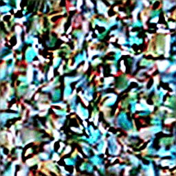
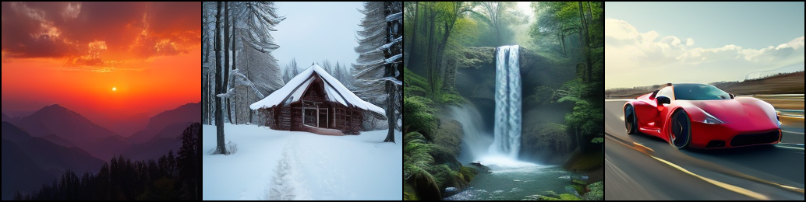

# Diffusion From Scratch

A ~258M parameter text-to-image model that generates 256x256 images from text prompts using rectified flow and a diffusion transformer built from scratch. Trained on 200k image-text pairs.



- [Get Started](#get-started)

## Overview

The VAE compresses a 256x256 image down to a 4x32x32 latent. Noise gets mixed in, and the model learns to predict the velocity that takes it back to the clean image. At generation time it starts from pure noise and walks back to a clean image over 28 Euler steps.




## Architecture

The architecture is inspired by [Qwen-Image](https://arxiv.org/abs/2508.02324).

### Dual-Stream Blocks

Text and image tokens live in separate streams but attend to each other. Both streams get modulated by the timestep through adaLN-Zero which produces shift, scale, and gate values for each one. Q, K, and V are computed separately per stream and normalized with RMSNorm, then concatenated into a single sequence for joint attention. After that the streams split back and each one passes through its own feedforward network.

- 77 text tokens + 256 image tokens = 333 token joint sequence
- QK-RMSNorm on all Q and K projections
- All gates start at zero so the model begins as an identity function, keeping early training stable

### MSRoPE

Standard RoPE only handles 1D sequences, but images are 2D grids with text tokens mixed in. MSRoPE handles this by placing image tokens on a 2D grid centered at the origin and splitting the head dimension in half between height and width. Text tokens sit on the diagonal starting just outside the image region.

- 16x16 image grid spans positions -8 to +7 on both axes
- Text token 0 lands at (8,8), token 1 at (9,9), and so on
- Same position on both axes makes text encoding effectively 1D
- Centering at (0,0) helps generalize to higher resolutions at inference

```
         width -->
    -8  -7  ...  +7
-8  [img] [img] [img]
-7  [img] [img] [img]      <-- image: centered 2D grid
...
+7  [img] [img] [img]
                    (8,8)   txt_0
                    (9,9)   txt_1   <-- text: diagonal
                   (10,10)  txt_2
```

### Rectified Flow

Instead of a complex noise schedule, rectified flow just draws a straight line between data and noise. The model predicts velocity and the loss is MSE between predicted and target.

- Linear interpolation: `z_t = (1-t) * x_0 + t * noise`
- Velocity target: `v = noise - x_0`
- 28 Euler steps from t=1 (pure noise) to t=0 (clean image)
- Logit-normal timestep sampling (`t = sigmoid(randn())`) to focus training on harder intermediate steps

### Classifier Free Guidance

During training, 10% of text embeddings get randomly replaced with a null embedding so the model learns both conditional and unconditional generation. At inference each step runs two forward passes and extrapolates the difference:

```
v = v_uncond + cfg_scale * (v_cond - v_uncond)
```

- Higher cfg_scale pushes output closer to the prompt but reduces diversity
- Default cfg_scale is 4.0

## Config

Qwen-Image runs at 20B parameters with 60 layers, a 7B vision-language model for text encoding, and a custom 16-channel VAE. This project inspired from its architecture at a scale that lower computing requirements.

| | Qwen-Image | This project |
|---|---|---|
| **Parameters** | 20B | **~258M** |
| **Layers** | 60 | 12 |
| **Heads / Head dim** | 24 / 128 | 12 / 64 |
| **Hidden dim** | 3072 | 768 |
| **Text encoder** | Qwen2.5-VL (7B) | CLIP ViT-L/14 |
| **VAE** | 16-ch Wan-2.1 | 4-ch SD VAE |
| **RoPE** | 3-axis (frame, h, w) | 2-axis (h, w) |
| **Resolution** | up to 1328px | 256px |

# Get started

```bash
pip install -r requirements.txt
```

### 1. Prepare the dataset

Downloads images from [text-to-image-2M](https://huggingface.co/datasets/jackyhate/text-to-image-2M) and encodes them into VAE latents and CLIP embeddings:

```bash
cd src
python prepare_dataset.py --num_samples 200000
```

### 2. Train

```bash
python train.py --data_dir data/text2img --batch_size 128 --epochs 200
```
For resume from checkpoint:

```bash
python train.py --resume checkpoints/best.pt --epochs 300
```

### 3. Generate

```bash
python sample.py --prompt "a sunset over mountains"
python sample.py --prompt "a red sports car" --cfg 6.0 --steps 50 --num 4
```

